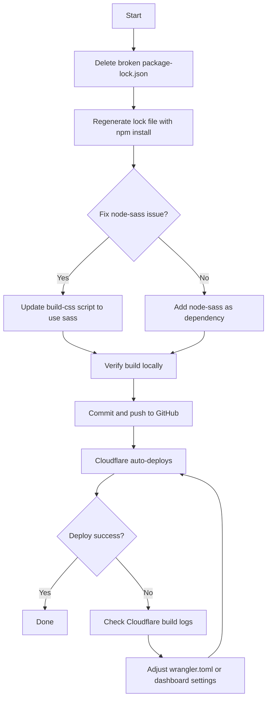

# Fix Cloudflare Pages Deployment Plan

## Root Cause Analysis

### Issue 1 (Critical — Blocking Deploy): Broken `package-lock.json`

The current `package-lock.json` at commit `abd5d89` is **severely incomplete**. It only contains ~20 entries for transitive dependencies (mostly from `sass`), but is missing **ALL** direct dependencies listed in `package.json`:

| Missing Package | Type | Specifier |
|---|---|---|
| `aframe` | dependency | `googlecreativelab/aframe#v0.6.0c-mod` |
| `aframe-daydream-controller-component` | dependency | `jeremyabel/aframe-daydream-controller-component` |
| `bezier-easing` | dependency | `2.0.3` |
| `clone-deep` | dependency | `^1.0.0` |
| `eventemitter3` | dependency | `2.0.2` |
| `ios-safe-audio-context` | dependency | `1.0.1` |
| `promise-polyfill` | dependency | `6.0.2` |
| `qs` | dependency | `6.4.0` |
| `screenfull` | dependency | `^3.3.1` |
| `sono` | dependency | `^2.1.2` |
| `tween.js` | dependency | `^16.6.0` |
| `web-audio-player` | dependency | `1.3.1` |
| `webvr-ui` | dependency | `^0.10.0` |
| `whatwg-fetch` | dependency | `^2.0.3` |
| `babel-preset-es2015` | devDependency | `^6.16.0` |
| `babel-preset-stage-2` | devDependency | `^6.22.0` |
| `babelify` | devDependency | `^7.3.0` |
| `browserify` | devDependency | `^14.0.0` |
| `budo` | devDependency | `^9.4.7` |
| `derequire` | devDependency | `^2.0.3` |
| `discify` | devDependency | `^1.6.0` |

Since `npm ci` (used by Cloudflare by default) requires the lock file to contain every package from `package.json`, it fails with `Missing: <pkg> from lock file`.

**Fix:** Delete the broken lock file and regenerate it with `npm install`.

### Issue 2 (Secondary — Will Block Build): `node-sass` command not available

The build-css script calls `node-sass`:
```json
"build-css": "node-sass --include-path scss src/scss/main.scss public/css/vr.css"
```

But the dependency is `sass` (Dart Sass), not `node-sass` (LibSass bindings). These are **different packages** with different CLI commands. On a clean Cloudflare environment, `node-sass` will not be available unless explicitly added to `dependencies` or `devDependencies`.

**Fix:** Either:
- Replace the script to use `sass` command instead: `"build-css": "sass src/scss/main.scss public/css/vr.css"`
- Or add `node-sass` as a dependency (deprecated, not recommended)

### Issue 3 (Minor): No `.gitignore` file

There is no `.gitignore` file, which means `node_modules/` could accidentally be committed.

---

## Step-by-Step Fix Plan



### Step 1: Delete the broken `package-lock.json`
- Delete the current incomplete lock file
- This ensures a completely fresh regeneration

### Step 2: Regenerate `package-lock.json`
Run locally:
```bash
npm install --legacy-peer-deps
```
The `--legacy-peer-deps` flag matches your Cloudflare build command and is needed because of peer dependency conflicts in the A-Frame ecosystem.

### Step 3: Fix the `node-sass` / `sass` mismatch
The `build-css` script needs to be updated. Two options:

**Option A (Recommended):** Replace `node-sass` with `sass` in the build script
```json
"build-css": "sass --load-path=scss src/scss/main.scss public/css/vr.css"
```
The `sass` (Dart Sass) package is already in `devDependencies`.

**Option B (Fallback):** Add `node-sass` to dependencies
```json
"devDependencies": {
    ...
    "node-sass": "^9.0.0",
    "sass": "^1.77.0"
}
```

### Step 4: Add `.gitignore`
Create a `.gitignore` file to prevent `node_modules/` from being committed:
```
node_modules/
public/css/
```

### Step 5: Verify the build locally
```bash
npm install --legacy-peer-deps
npm run build-css
npm run build
```
This should produce the expected output files without errors.

### Step 6: Commit and push to GitHub
```bash
git add package-lock.json package.json .gitignore
git commit -m "Regenerate package-lock.json and fix build script"
git push
```

### Step 7: Verify Cloudflare build
Cloudflare Pages should auto-deploy from the GitHub push. The build command in dashboard is already set to:
```
npm install --legacy-peer-deps && npm run build-css && npm run build
```
Output directory: `public`

---

## What Your Cloudflare Dashboard Should Look Like

| Setting | Value |
|---|---|
| Build command | `npm install --legacy-peer-deps && npm run build-css && npm run build` |
| Build output directory | `public` |
| Root directory | *(leave blank)* |
| Build comments | Enabled |

No `wrangler.toml` is strictly necessary since these settings are already configured in the dashboard.