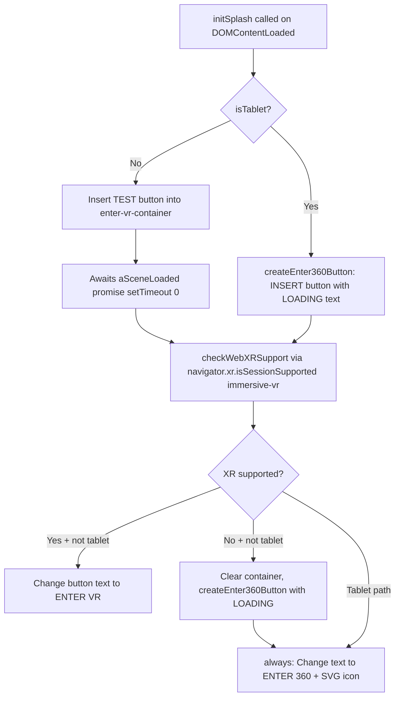

# "ENTER 360" Button Visibility — Root Cause Analysis

## 1. How splash.js Is Built & Deployed

### Critical Architectural Finding

There are **two** `splash.js`-related files, and they serve **completely different** purposes:

| File | What It Contains | How It's Built | How It's Deployed |
|---|---|---|---|
| [`public/js/splash.js`](public/js/splash.js) | Only the About button toggle handler (33 lines) | **NOT built** — committed directly as a static file | Loaded via `<script src="js/splash.js">` in [`public/index.html`](public/index.html:32) |
| [`src/js/splash/splash.js`](src/js/splash/splash.js) | Full VR/XR detection + ENTER 360/VR button logic (220 lines) | Browserified INTO [`public/js/vr.js`](public/js/vr.js) via the [`src/js/vr.js`](src/js/vr.js:63) entry point | Loaded as part of `<script src="js/vr.js">` in [`public/index.html`](public/index.html:34) |

### Build Script (from [`package.json`](package.json:9))

```json
"build": "npm run copy-aframe && browserify --exclude=aframe src/js/vr.js > public/js/vr.js"
```

The splash source at [`src/js/splash/splash.js`](src/js/splash/splash.js) is imported by [`src/js/vr.js:63`](src/js/vr.js:63) (`import { initSplash } from './splash/splash'`) and gets browserified together with all other modules into the single `public/js/vr.js` bundle. **There is no separate build step for `public/js/splash.js`.**

### Script Loading Order (from [`public/index.html:30-34`](public/index.html:30-34))

```html
<script src="js/ga.js"></script>         <!-- Google Analytics -->
<script src="js/fallback.js"></script>   <!-- WebAudio/WebGL fallback check -->
<script src="js/splash.js"></script>      <!-- About button handler ONLY -->
<script src="js/aframe.min.js"></script>  <!-- A-Frame library -->
<script src="js/vr.js"></script>          <!-- VR app + splash init + ENTER 360 button -->
```

The [`initSplash()`](src/js/splash/splash.js:30) function is called inside `vr.js` on `DOMContentLoaded` ([`src/js/vr.js:71-74`](src/js/vr.js:71-74)):

```js
document.addEventListener("DOMContentLoaded", () => {
    testCompatibility();
    initSplash();
});
```

### Cloudflare Deploy

From the deployment plan at [`plans/fix-cloudflare-deployment.md`](plans/fix-cloudflare-deployment.md:128-131), the Cloudflare build command is:

```
npm install --legacy-peer-deps && npm run build-css && npm run build
```

This means Cloudflare runs `browserify --exclude=aframe src/js/vr.js > public/js/vr.js` to produce the deployed `public/js/vr.js`. The `public/js/splash.js` file is **never rebuilt** — it's always served as-is from the repo.

---

## 2. Exact Code Controlling the ENTER 360 Button Visibility

All line references below are from the **deployed (built)** file [`public/js/vr.js`](public/js/vr.js).

### The Decision Flow (lines 18281–18428)



### Key Code Locations in `public/js/vr.js`

| Step | Lines | Code |
|---|---|---|
| Tablet check | 18355–18357 | `if (PlatformUtils.isTablet()) { createEnter360Button(); }` |
| VR button insertion | 18368–18370 | `if (!isTablet()) { enterVRContainer.insertBefore(enterVR, ...); }` |
| WebXR detection | 18360–18365 | `checkWebXRSupport()` checks `navigator.xr.isSessionSupported('immersive-vr')` |
| XR result handling | 18420–18427 | If NOT supported AND not tablet → clear container, create 360 fallback button |
| Button text assignment | 18406–18417 | `always()` decides: ENTER VR (if VR supported) or ENTER 360 (if tablet or VR not supported) |
| Container HTML structure | [`public/index.html:49-52`](public/index.html:49-52) | `<div id="enter-vr-container" style="color: #ffffff">` |

### The `always()` Function (lines 18405–18418)

```js
function always() {
    if (vrSupported && !(isMobile() && isTablet())) {
        enterVR.innerHTML = '<div ...>ENTER VR</div>';
        enterVR.onclick = function() { /* enter VR */ };
    } else if (isTablet() || !vrSupported) {
        document.querySelector('.webvr-ui-title').innerHTML = SVG_360 + '<span>ENTER 360</span>';
        document.querySelector('.webvr-ui-title').classList.add('mode360');
    }
}
```

### CSS Visibility (from [`public/css/vr.css:253-263`](public/css/vr.css:253-263))

```css
#enter-vr-container {
    position: relative;
    display: block;       /* NOT hidden */
    margin-left: auto;
    margin-right: auto;
    margin-top: 15px;
    min-width: 170px;
    min-height: 46px;
    text-align: center;
}
```

The container is **always visible** (`display: block`). The button visibility is controlled entirely by JavaScript DOM manipulation.

### The `isTablet()` Heuristic (from [`src/js/utils/platform-utils.js:46-49`](src/js/utils/platform-utils.js:46-49))

```js
isTablet() {
    return Math.max(window.screen.width, window.screen.height) /
           Math.min(window.screen.width, window.screen.height) < 1.35 &&
           !/(Oculus|Gear)/.test(navigator.userAgent);
}
```

This uses an **aspect ratio heuristic**: screens with ratio < 1.35 (i.e., nearly square, like 4:3 at 1.33) are classified as tablets. This can **misclassify** 4:3 desktop monitors or unusual screen resolutions.

---

## 3. Why the Button Is NOT Appearing

### Finding A: `public/js/splash.js` Is a Red Herring ✅ (Not the Problem)

The `public/js/splash.js` file served from Cloudflare is **correct** — it has always been just the About button handler. The real splash logic is inside `public/js/vr.js`.

### Finding B: The ENTER 360 Logic in the Built Code Is Correct ✅

The WebXR detection code at [`public/js/vr.js:18360-18365`](public/js/vr.js:18360-18365) is present and properly implemented. The fallback path correctly shows ENTER 360 when VR is not supported.

### Finding C: Most Likely Root Cause — Button Shows "TEST" in Initial State ⚠️

The button initially shows **"TEST"** as its text (line 18306: `enterVR.innerHTML = '<div ...>TEST</div>'`). This text is replaced asynchronously after the XR support check completes. If the XR check hangs or the promise chain breaks, the button stays stuck on "TEST", which looks like the button isn't working.

### Finding D: Potential Async Failure — `checkWebXRSupport` Rejection ⚠️

If [`navigator.xr.isSessionSupported('immersive-vr')`](src/js/splash/splash.js:103) **rejects** (e.g., `SecurityError` on insecure origins, or `NotFoundError`), the promise chain has an error handler at line 18427:

```js
.then(function(supported) { ... }, always).then(always);
```

The first `always` runs as the rejection handler, where `vrSupported` is still `false`. This SHOULD still trigger the ENTER 360 path. However, if the rejection throws **again** inside `always()`, the second `.then(always)` would NOT execute, and the button text would stay as "TEST".

### Finding E: Possible Early JS Runtime Error Preventing `initSplash()` 🔴

The most likely cause: a **JavaScript error** in one of the modules bundled into `public/js/vr.js` runs **before** the `DOMContentLoaded` handler that calls `initSplash()`. The `vr.js` entry point has many `require()` calls at the top level (lines 23–61) and also calls `testCompatibility()` at line 72. If any of these throw, `initSplash()` never runs and the button is never created.

### Finding F: `isTablet()` Misclassification Risk 🟡

If the user's browser reports a screen resolution with aspect ratio < 1.35 (common on 4:3 monitors or in certain responsive viewport modes), `isTablet()` returns `true`. This would:
1. Call `createEnter360Button()` immediately (button IS created)
2. Prevent the VR button from being inserted
3. Skip the XR check result processing in the non-tablet branch

The button would still show, but with "LOADING" until the async `always()` runs. If the async chain breaks, it stays on "LOADING".

---

## 4. What Needs to Be Fixed

### Priority 1: Replace "TEST" Placeholder with Meaningful Feedback

In [`src/js/splash/splash.js:51`](src/js/splash/splash.js:51), replace:
```js
enterVR.innerHTML = '<div class="webvr-ui-title" style="display: initial;">TEST</div>';
```
with:
```js
enterVR.innerHTML = '<div class="webvr-ui-title" style="display: initial;">LOADING</div>';
```

This prevents the confusing "TEST" text from showing.

### Priority 2: Add Defensive Error Handling in the Async Chain

In [`src/js/splash/splash.js:161-170`](src/js/splash/splash.js:161-170), ensure the rejection handler in the promise chain is robust. Currently:
```js
return checkWebXRSupport()
    .then(function(supported) { ... }, always)
    .then(always);
```

If `always()` throws (e.g., because `.webvr-ui-title` doesn't exist in the DOM), the second `.then(always)` never runs. Add a `.catch()` with a direct DOM fallback:

```js
.then(function(supported) { ... }, function(err) {
    console.warn('XR check failed, falling back to 360 mode', err);
    if (!PlatformUtils.isTablet()) {
        enterVRContainer.innerHTML = '';
        createEnter360Button();
    }
})
.then(always)
.catch(function(err) {
    console.error('Splash init error:', err);
    // Force-show ENTER 360 as last resort
    enterVRContainer.innerHTML = '';
    var btn = document.createElement('button');
    btn.className = 'webvr-ui-button';
    btn.innerHTML = '<div class="webvr-ui-title mode360">' + SVG_360 + '<span>ENTER 360</span></div>';
    enterVRContainer.appendChild(btn);
});
```

### Priority 3: Verify Cloudflare Build Output

Confirm that the deployed `public/js/vr.js` on Cloudflare matches the locally built version. An easy check: search the deployed file for `isSessionSupported` to confirm the WebXR code is present. If missing, the deployment may have served a stale cached version.

### Priority 4 (Optional): Review `isTablet()` Heuristic

Consider adding a user-agent check to [`src/js/utils/platform-utils.js:46-49`](src/js/utils/platform-utils.js:46-49) to prevent desktop browsers from being misclassified as tablets:

```js
isTablet() {
    return Math.max(window.screen.width, window.screen.height) /
           Math.min(window.screen.width, window.screen.height) < 1.35 &&
           !/(Oculus|Gear)/.test(navigator.userAgent) &&
           /(iPad|Android)/.test(navigator.userAgent);  // Add actual mobile UA check
}